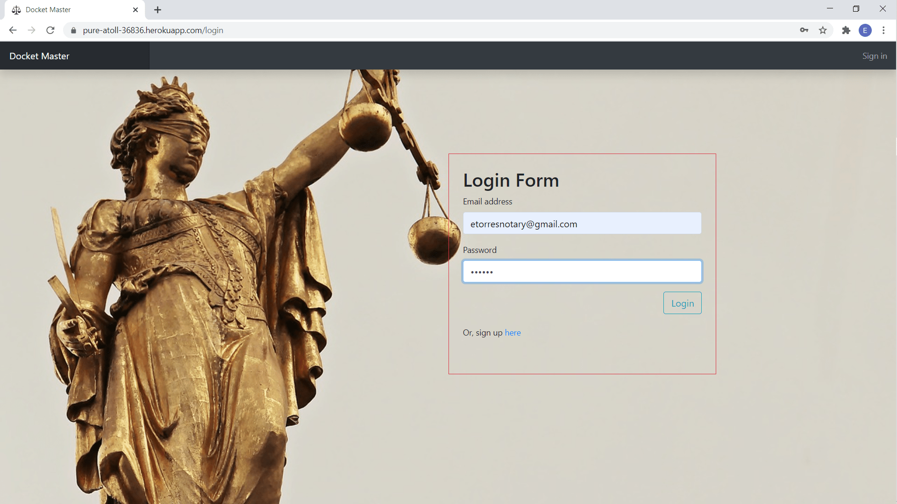
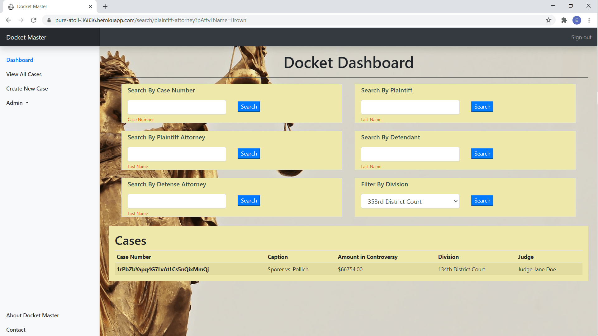
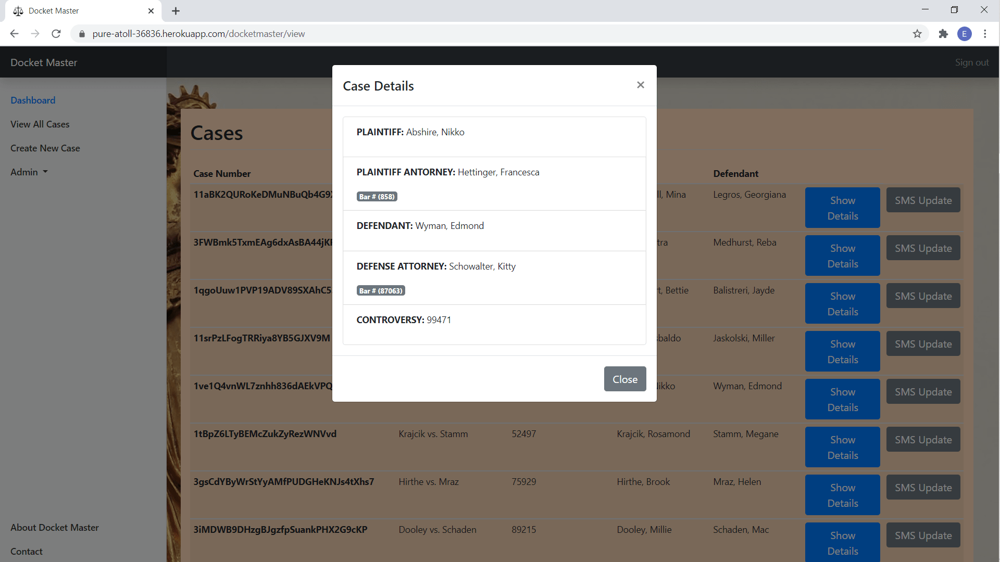
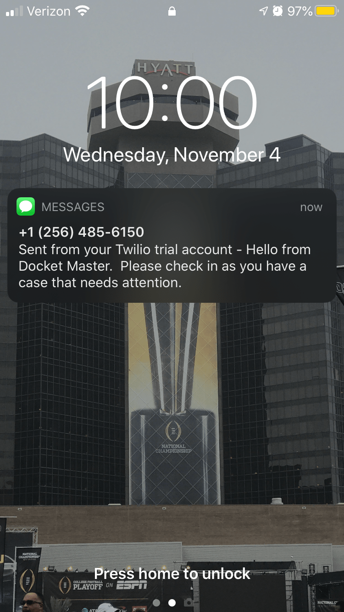
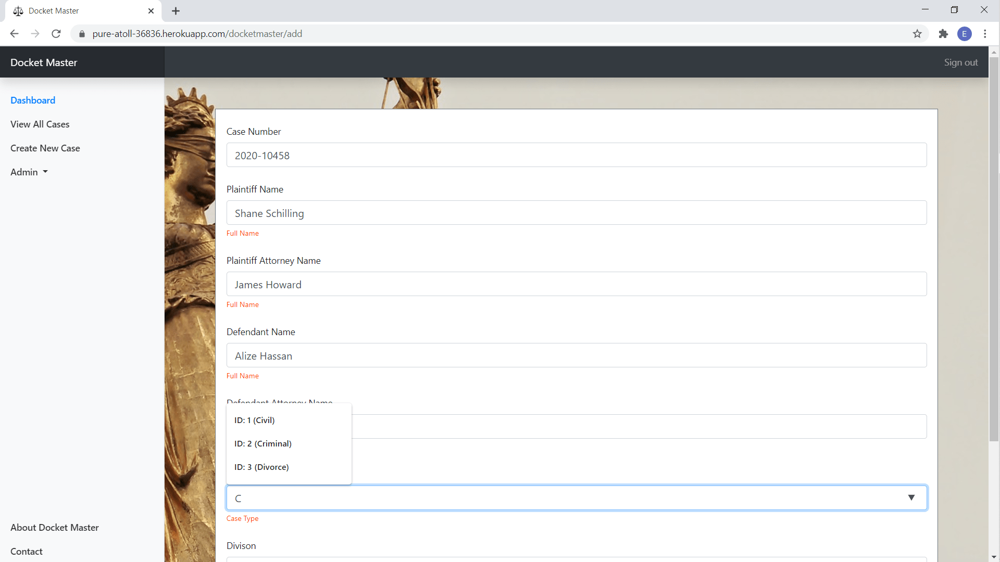
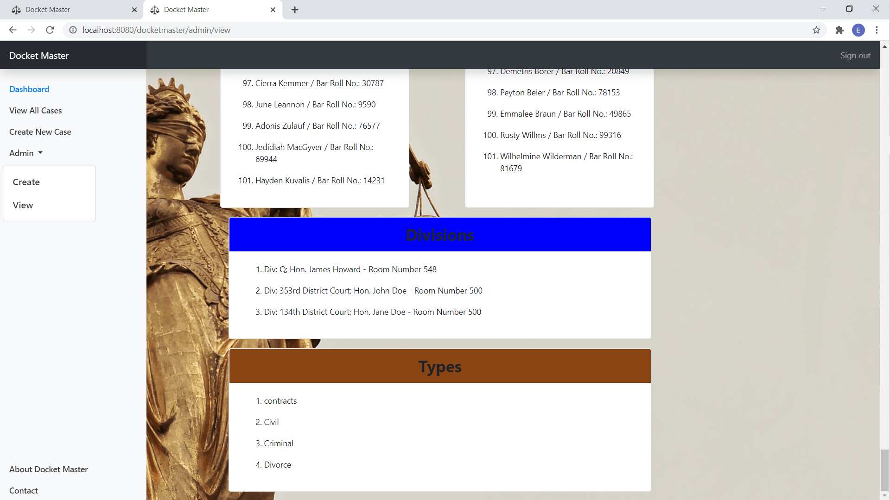
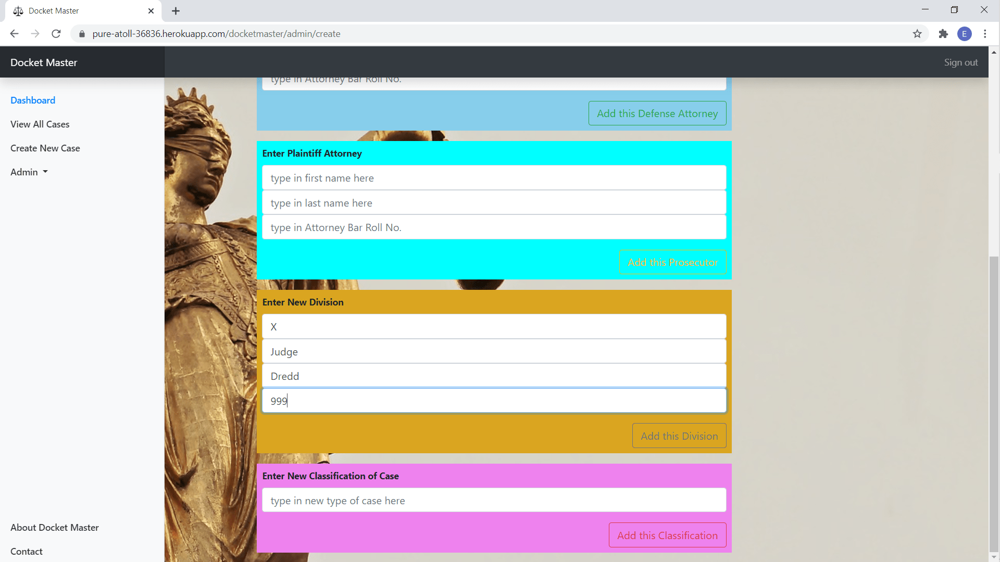

# Docket Master

## Project Description

The integrated court system is a fast-paced, dynamic environment that changes by the moment. Docket Master helps participants to keep track of the cases, litigants, attorneys, as well as the Division the case is located and the amount of the case.

Docket Master uses MySQL to organize its back-end. Sequelize provides the Object Relational Mapping (ORM) support. Express provides routing and middleware capabilities. Node.js is the runtime environment for Docket Master. HTML, CSS, Bootstrap, and Express Handlebars provide the views for user interaction and interface with Docket Master.

## Table of Contents

- [Title](#project-title)
- [Description](#project-description)
- [Table of Contents](#table-of-contents)
- [Installation](#installation-instructions)
- [Usage](#usage)
- [Contributing](#guidelines-for-contributing)
- [Tests](#tests)
- [Technologies](#technologies-used)
- [Collaborators](#collaborators)
- [Questions](#questions)
- [License](#license)

## Installation Instructions

If you are interested in using Docket Master, the [Docket Master repo](https://github.com/etorres-revature/Docket_Master) can be cloned. Then in VS Code type "node server" in the integrated terminal. Or,users can test the [deployed Docket Master app](https://pure-atoll-36836.herokuapp.com/).

## Usage

[Docket Master is deployed](https://pure-atoll-36836.herokuapp.com/), and users can try out its functionality there.

### Docket Master Features

1. **AUTHENTICATION** of users. Users must sign up to use Docket Master and in later sessions use the information from sign up to log in to Docket Master.

2. **DASHBOARD** cases. The Docket Master Dashboard is designed to give users the ability to search through cases with a multitude of search parameters.

3. **VIEW ALL** cases. Comprehensive list of cases with modal functionality to dig deeper into case details.

4. **SEND SMS TEXT** to Docket Master user. When a case needs attention, Docket Master has SMS text capability to be in touch when your on the go.

5. **CREATE CASE** form. Users can enter new cases via this form.

6. **ADMIN VIEW TABLE**. Docket Master provides functionality to GET what is contained in each of the tables that supports the CASE table.

7. **ADMIN CREATE TABLE ENTRY**. Docket Master provides functionality to POST a new entry into each of the tables that supports the CASE table.

## Guidelines for Contributing

Thoughts and suggestions regarding future updates for Docket Master can be e-mailed to the authors/collaborators below.

## Tests

Test early; test often.

### Technologies Used

### :computer: :computer: :computer: :computer: :computer: :computer:

#### :memo: HTML5 :memo:

**HTML5** is a markup language used for structuring and presenting content on the World Wide Web. The goals are to improve the language with support for the latest multi-media and other new features; to keep the language both easily readable by humans and consistently understood by computers and devices; and to remain backward compatible to older software. Many new symantec features are included.

_HTML5_ content borrowed from <a target="_blank" rel="noopener noreferrer">[this page](https://en.wikipedia.org/wiki/HTML5).</a>

#### :art: CSS :art:

**Cascading Style Sheets (CSS)** is a stylesheet language used for describing the presentation of a document written in a markup language (such as HTML5). CSS is designed to enable the separation of presentation and content; including layout, colors, and fonts. This separation improves content accessibility to provide more flexibility and control in the specification of presentation characteristics, enabling multiple web pages to share formatting by specifying relevant CSS in a separate file, which reduces complexity and repetition in the structural content (HTML), as well as enabling the file to be cached to improve the page load speed between the pages that share the file and its formatting.

Separation of formatting and content also makes it feasible to present the same markup page in different styles for different rendering methods, such as on-screen, in print, by voice, and on Braille-based tactile devices.

_CSS_ content borrowed from <a target="_blank" rel="noopener noreferrer">[this page](https://en.wikipedia.org/wiki/Cascading_Style_Sheets).</a>

#### :shoe: Bootstrap 4 :shoe:

**Bootstrap 4** is a free and open-source CSS framework directed at responsive, mobile-first front-end web development. It contains CSS and (optionally) JavaScript-based design templates for typography, forms, buttons, navigation, and other interface components.

_Bootstrap 4_ content borrowed from <a target="_blank" rel="noopener noreferrer">[this page](https://en.wikipedia.org/wiki/Bootstrap\_(front-end_framework)).</a>

#### :sparkler: JavaScript :sparkler:

**JavaScript (JS)** is one of the core technologies of the World Wide Web (along with HTML and CSS). It enables interactive web pages and is an essential part of web applications. JS is a multi-faceted, scripting language that provides versatility through Application Programming Interfaces (APIs) and Document Object Model (DOM) manipulation, among others.

_JavaScript_ content borrowed from <a target="_blank" rel="noopener noreferrer">[this page](https://en.wikipedia.org/wiki/JavaScript).</a>

#### :globe_with_meridians: NODE.js :globe_with_meridians:

**NODE.js** is an open-source, cross-platform JavaScript runtime environment that execute JavaScript code outside a web browser. NODE.js lets developers use JavaScript to write command line tools and for server-side scripting. NODE.js represents a "Javascript everywhere" paradigm, unifying web-application development around a single programming language, rather than different programming languages for server- and client-side scripts.

_NODE.js_ content borrowed from <a target="_blank" rel="noopener noreferrer">[this page](https://en.wikipedia.org/wiki/Node.js).

[Download Node.js](https://nodejs.org/en/).

#### :satellite: Express.js :satellite:

**Express.js** is a minimal and flexible NODE.js web application framework that provides a robust set of features for web and mobile applications. The myriad HTTP utility methods and middleware allow for the creation of a robust API. Express.js provides a thin layer of fundamental features, without obscuring NODE.js features.

_Express.js_ content borrowed from <a target="_blank" rel="noopener noreferrer">[this page](https://expressjs.com/).</a>

#### :card_index: MySQL :card_index:

**MySQL** is an open-source relational database management system(RDBMS). A relational database organizes data into one or more data tables. SQL is a language programmers use to create, modify, and extract data from the relational database, as well as control access to the database.

_MySQL_ content borrowed from <a target="_blank" rel="noopener noreferrer">[this page](https://en.wikipedia.org/wiki/MySQL).</a>

[Download MySQL](https://dev.mysql.com/downloads/mysql).

#### :neckbeard: Handlebars :neckbeard:

**Handlebars** is a simple _templating language_. It uses a template and an input object to generate HTML or other text formats. Handlebars templates look like regular text with embedded Handlebars expressions.

_Handlebars_ content borrowed from <a target="_blank" rel="noopener noreferrer">[this page](https://handlebarsjs.com/guide/).</a>
